# HW3
1.Частотные слова
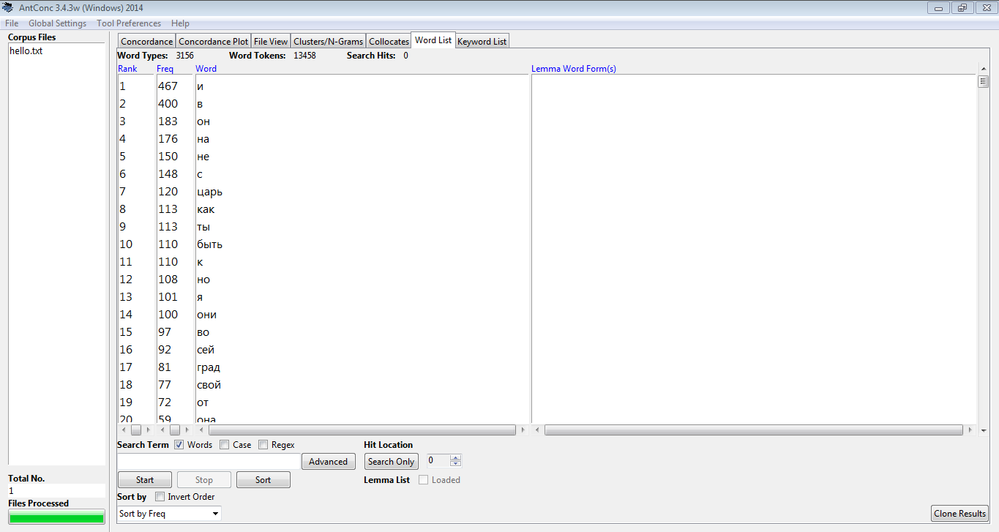
2.Частотные слова со списком стоп-слов
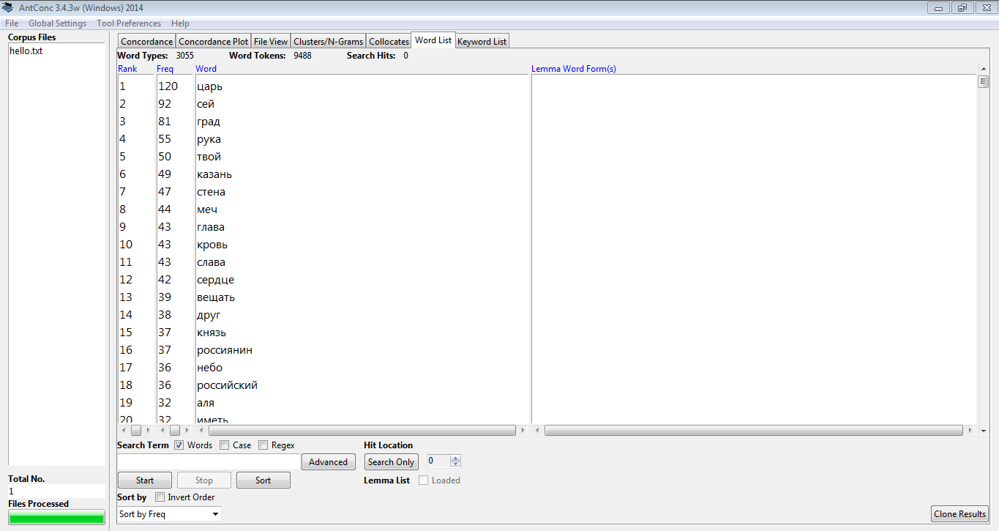
3.Устаревшие слова
1)
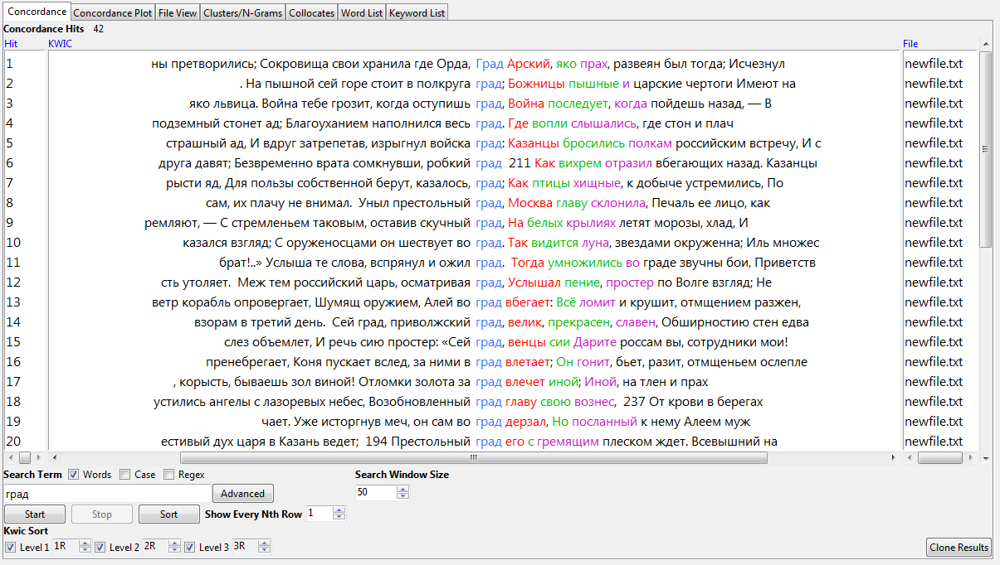
2)
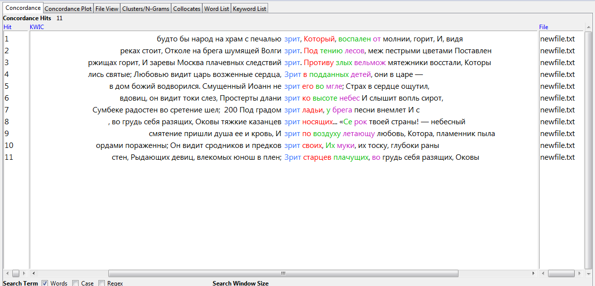
3)
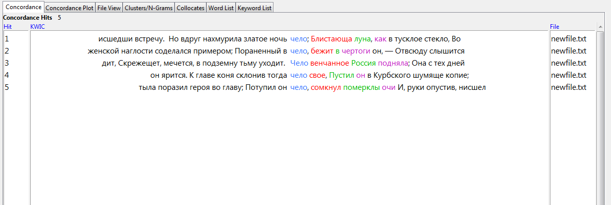
4.Частотный список N-Grams
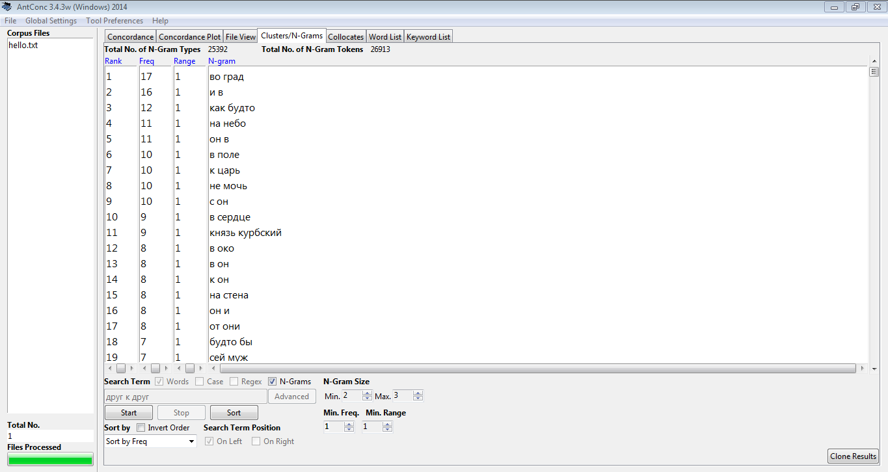
5.Списки коллокатов
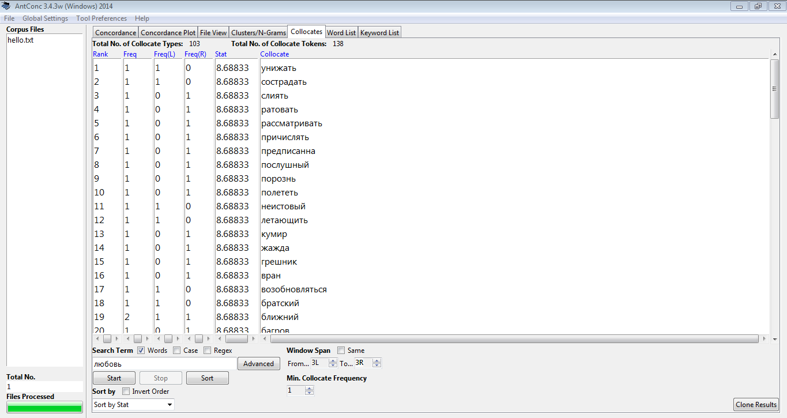

2. Google Ngrams и НКРЯ
1-2. Для исследования я выбрала следующие слова: «хлад», «пламень» и «чело». Соответствующими аналогами для них являются слова «холод», «пламя» и «лоб». Анализ в GoogleNGrams показал, что слово «хлад» употреблялось чаще современного аналога, но ближе к 1800 году «холод» начало использоваться гораздо чаще. НКРЯ демонстрирует последовательный рост популярности слова «холод» и резкий спад популярности устаревшего слова во второй половине 18 века.
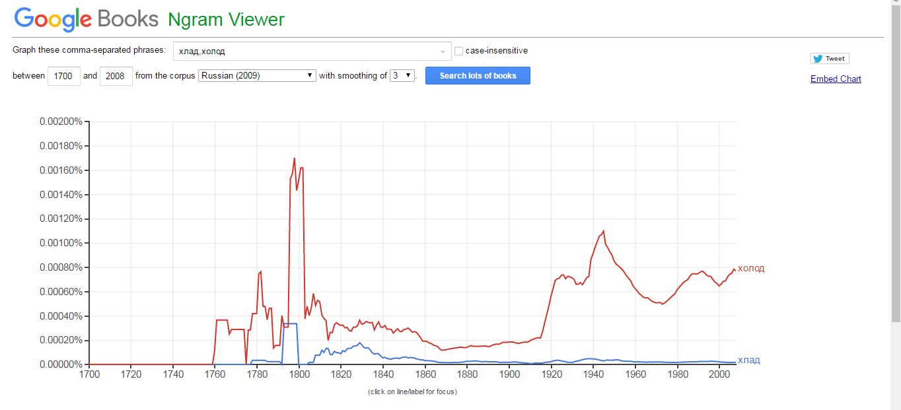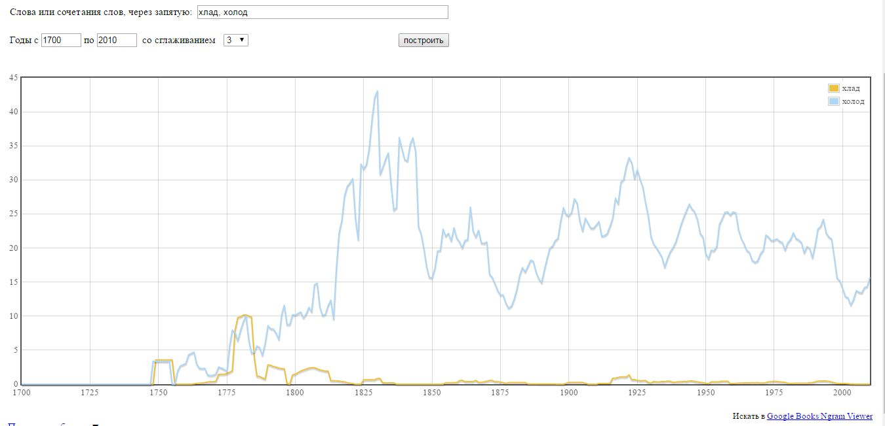
Анализ слов «пламя» и «пламень» в Google показывает, что устаревшее слово активно использовалось на протяжении всего 18 века, а в первой четверти 19 века «пламя» обретает большую популярность. В то время как НКРЯ показывает скачкообразное развитие обоих слов до первой четверти 19 века, когда современный аналог начинает употребляться намного чаще.
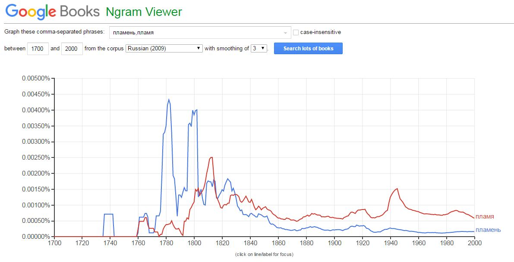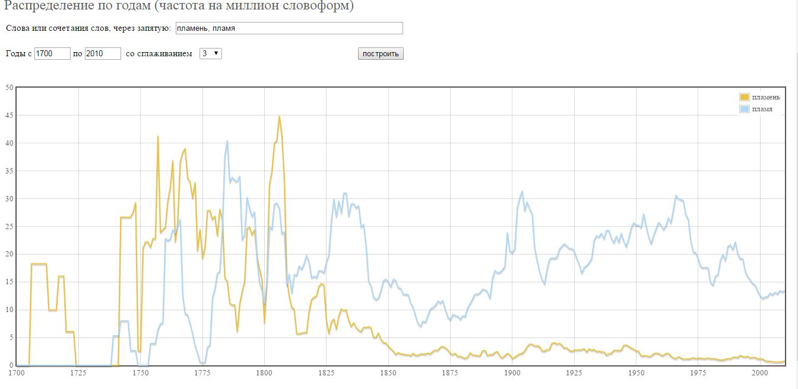
Согласно статистике Google, слово «чело» употреблялось чаще современного аналога на протяжении как 18 так и 19 веков. На графике НКРЯ «лоб» входит в постоянное употребление приблизительно в 1825 году, до этого слова использовались почти одинаково часто.
Как можно легко заметить, графики НКРЯ и Google сильно отличаются друг от друга. Делать выбор в пользу одного корпуса рискованно, т.к. необходимо узнать, в каком из корпусов база текстов более полная.
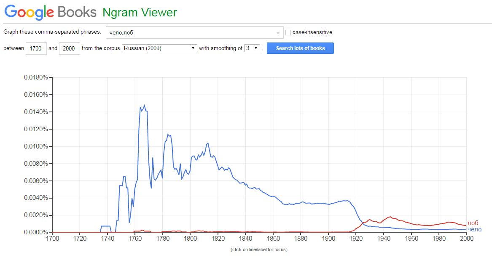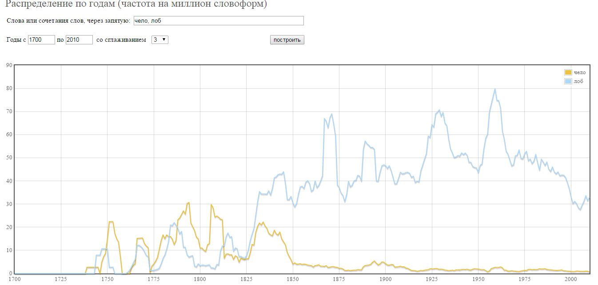
3. Ipm слов
Хлад – 0,536; пламень – 2,392; чело – 2,395
3. Использование инструментов корпусного анализа в профессиональной деятельности.
Исследование корпуса НКРЯ помогло выяснить, в какой период слова перестали употребляться, уступив место аналогам, которые мы используем сейчас. Визуализация употребления слова в виде графика – наиболее удобный и наглядный способ его исследования. Такой способ оказался новым для меня. Прослеживание истории развития конкретного слова не просто познавательно, но и полезно при исследовании литературы 18-19 веков!
